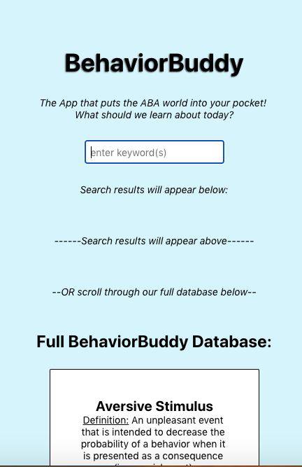

# Behavior_Buddy_Front_End

## Table of Contents

- [Description](#Description)
- [Links](#Links)
- [Future Work](#Future-Work)
- [Install](#Install)
- [Built With](#Built-With)
- [Code Organization](#Code-Organization)
- [References](#References)
- [Design Documentation](#Design-Documentation)
- [User Stories](#User-Stories)
- [Authors](#Author)
 
 
## Description

This is a React Native application that contains a node.js backend database. The database includes information regarding Applied Behavior Analysis (ABA), the leading science for the study of behavior, which is especially relevant to families and teachers of children with special needs. The intention for this application is to be an easy-to-use way to look up information about behaviors, find ways to work through each situation, and even benefit from a list of helpful resources. The user is able to search the database for keywords, or they can just scroll through the database until they find what they are looking for. Ultimately, I want this to be a handheld way for families & teachers to quickly find suggestions on how to deal with a variety of situations. 

## Link

- [You can access our backend node.js API here](https://github.com/ajhutchins/Behavior_Buddy)

## Future Work

This project would really benefit from having a more thoroughly completed database for the user to benefit from. Along those lines, it would really benefit from a user authentication for qualified ABA professionals to be able to add to the database so there's a wider net of what people are able to search for. A few additional features that would really elevate the application also include a google map api that shows local professionals that could help with certain situations, a list feature for individuals to keep their personal 'favorites' or behaviors they frequent. This application could actually be useful to the ABA community, so it is the intention to genuinely reach these additional goals.

## Install

You can fork this repo and run from node. You will need to set up the .env variables.
- Dependencies - npm packages (back end)
 - "dependencies": {
   - "cors": "^2.8.5",
   - "dotenv": "^8.2.0",
   - "express": "^4.17.1",
   - "express-session": "^1.17.1",
   - "mongoose": "^5.12.0"
 - },
 - "engines": {
   - "node": "14.15.4",
   - "npm": "6.14.10"
 - }

## Built With

- React Native
- MongoDB
- node.js
- express.js
- cors
- dotenv
- npm
- JavaScript

## Code organization

The project tries to follow the coding style guide provided by AirBnb.

## References

1. Publication Manual of the American Psychological Association, 6th Edition. ISBN: 10:1-4338-0561-8.
2. Cooper, J. O., Heron, T. E., & Heward, W. L. (2019). Applied Behavior Analysis (3rd Edition). Hoboken, NJ: Pearson Education.
3. [React Native Docs](https://reactnative.dev/docs/getting-started)

## Design Documentation

1. [Behavior_Buddy Wireframe](https://github.com/ajhutchins/Behavior_Buddy/blob/main/Scanned%20Documents.pdf)

### User Stories

#### MVP

1. User can see an 'index page' that includes 'index cards' of terms.
2. User can utilize a search bar at the top of the page that searches the index cards below.
3. User can also scroll through these terms to search for their desired term.
4. User can click on each term, which will reveal information, such as the definition, associated/suggested ABA methods, and resources to help guide the user through each situation.

#### STRETCH GOALS

1. User Authentication feature so user can have a profile and save favorite terms.
2. Create a way for admin users to add new terms (desktop version (CMS-like)).
4. Add 100+ terms to the app, so it might actually be useful out of the gate (nothing really like this exists, so I would really like to focus on expanding on the information of each index card to really try and make it useful for the user.
5. Add a 'Get Help Near Me' button that provides a googlemap of professionals within a certain radius.
6. Add other buttons to donate to Autism Speaks and Special Olympics.

## Author

A.J. Hutchins (Current Author)
